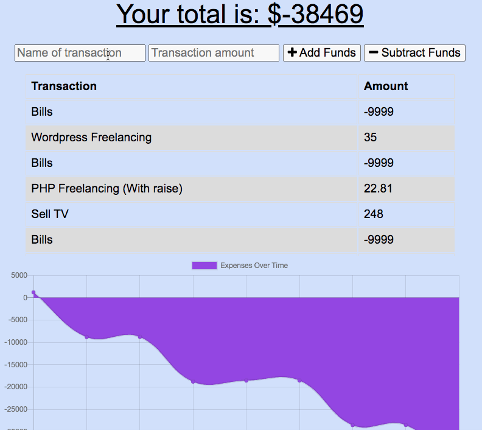
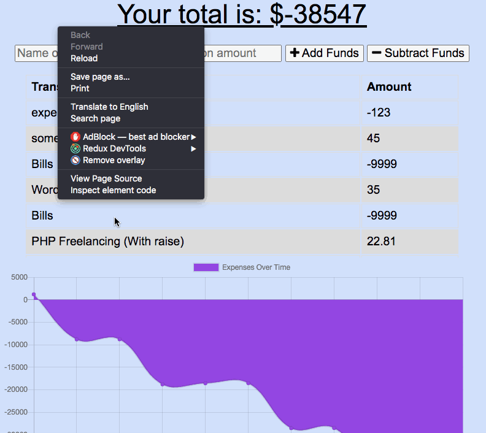

# [Budget Tracker](https://fast-earth-94685.herokuapp.com/)

This is a progressive web-app which allows users to track their budget through a simple table, and a graph. Users can input a source of income/expenses, and see the graph dynamically change based on the amount of incomes/expenses they have inputted.

## Very notable feature

This PWA utilizes indexedDB to ensure that even when a user is offline, they will be able to add information to the remote database. Once they are online again, the information in the client-side database will be sent to the MongoDB database and cleared from indexedDB.

## Built With

- [NodeJS](https://nodejs.org/)
- [Express](https://expressjs.com/)
- [MongoDB](https://www.mongodb.com/)
- [Mongoose](https://mongoosejs.com/)
- [Javascript](https://developer.mozilla.org/en-US/docs/Web/JavaScript)
- [CSS](https://developer.mozilla.org/en-US/docs/Web/CSS)
- [HTML](https://developer.mozilla.org/en-US/docs/Web/HTML)
- [ChartJS](https://www.chartjs.org/)

## Live deployed link

- [Check out the site here](https://fast-earth-94685.herokuapp.com/)

## Created by

**Matt Stephens**

- [Link to Portfolio Site](https://mstephen19.github.io/my-portfolio)
- [Link to Github](https://github.com/mstephen19)
- [Link to LinkedIn](https://www.linkedin.com/mstephen19)

### Acknowledgments

- Shoutout to [Jesse Lewis](https://www.linkedin.com/in/jesseaustinlewis/)
